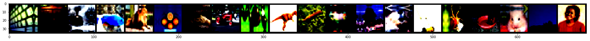
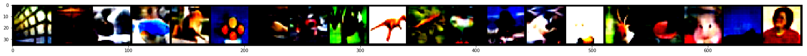

## Some toy demo Codes for Mixing Activations and Labels in Distributed Training for Split Learning
---
## Overview of MALM

**Fig.1 the overview of Split Learning with MALM**

---
## Directory of Source Code
---
|--**src**\
|--------**sl.py**: typical Split Learning (SplitNN)\
|--------**fl.py**: Federated Learning (FedAvg)\
|--------**local.py**: stand-alone training (Non-split)\
|--------**nopeeknn.py**: NoPeek training\
|--------**single_malm.py**: exploring the mix operations of MALM \
|--------**MALM.py**: malm (rebuilding.....)\
|--------**vis_rec.ipynb**: experiments about client-side attacks\
|--------**vis_rec_emnist.ipynb**: experiments about server-side attacks\
|--------**models**: models used to train\
|--------**dataprocess**: data preprocess\
|--------**utils**: some tools used in our codes\
|--------**dist**: algorithms in real-world setting(beta)\
|--**results**\
|--------**Decision Boundary**: experimental results about decision boundary\
|--------**Labels Visualization**: true labels and obfuscated labels\
|--------**Figures**: experimental results\
|--------**reconstruction**: experimental results of data reconstrution

---
## Some Important Configurations
> +  --epochs. The number of epochs to execute. E.g., --epochs 200
> + --gpu Assigning device (id) to execute programs. E.g., --gpu 0
> + --name. The file tag to identify experiments. E.g., --name test
> + --mix_num. Setting how many labels/activations used to mix. E.g., --mix_num 3
> + --dp. Executing DP-SL program. E.g., --dp
> + --cifar100. Training models on CIFAR-100
> + --google_split. Partitioning data using the strategy introduced in google's paper.
> + --model. Assgining model. E.g., --model ResNet18
> + --cifar100. whether using CIFAR-100 dataset
> + --mnist.  whether using MNIST dataset

## Privacy-Preserving Experiments
.eps)

**Fig.2 Distance correlation comparison under different settings. Experiments on CIFAR-100**

## Data Reconstruction Experiments

**Fig.3 20 samples of CIFAR-100 raw images**

**Fig.4 Case of data reconstraction (activations output from models trained by SL)**
.png)
**Fig.5 Case of data reconstraction (activations output from models trained by MALM(2-times))**
.png)
**Fig.5 Case of data reconstraction (activations output from models trained by MALM(3-times))**
.png)
**Fig.6 Case of data reconstraction (activations output from models trained by MALM(4-times))**
.png)
**Fig.7 Case of data reconstraction (activations output from models trained by MALM(5-times))**
.png)
**Fig.8 Case of data reconstraction (activations output from models trained by MALM(6-times))**
.png)
**Fig.9 Case of data reconstraction (activations output from models trained by MALM(7-times))**

## Acknowledge
---
We thank (https://github.com/TTitcombe/NoPeekNN)
